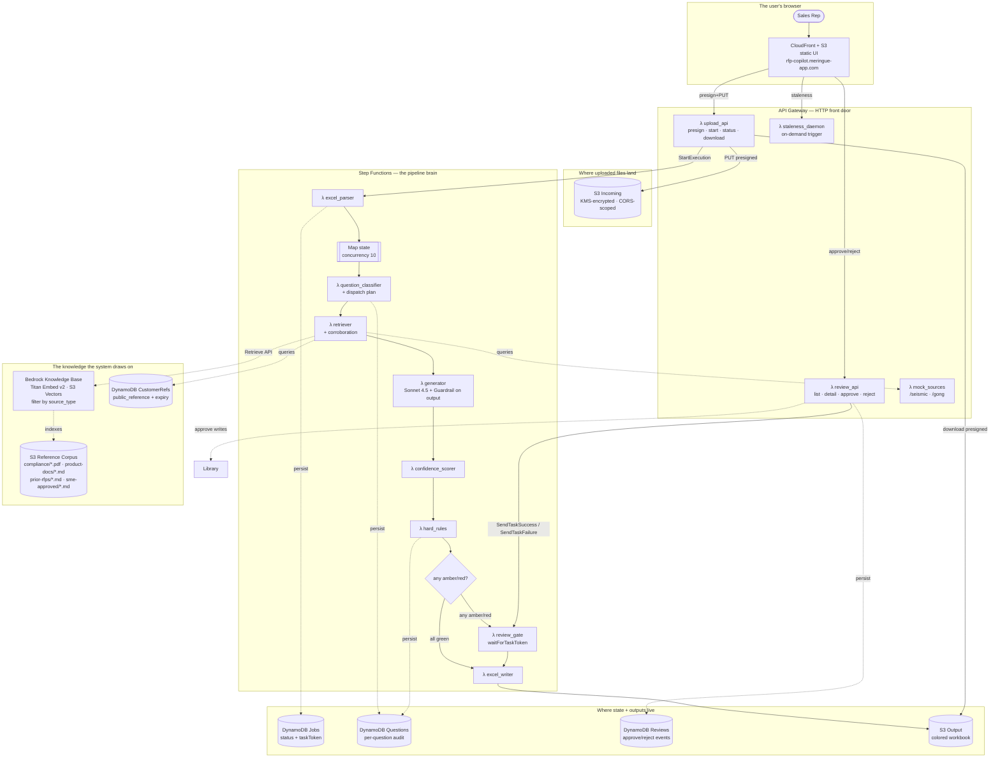
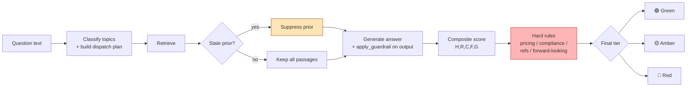
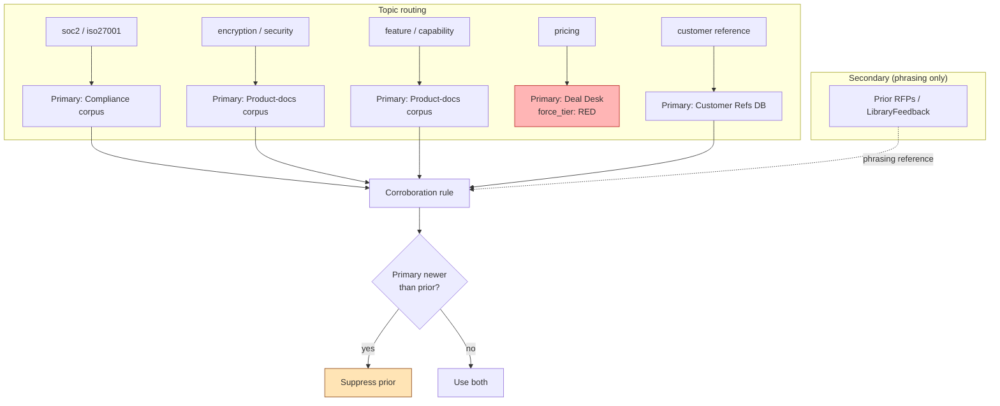
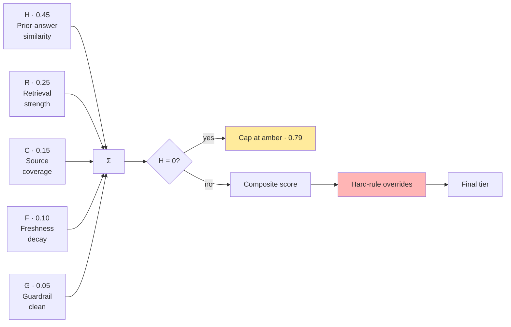
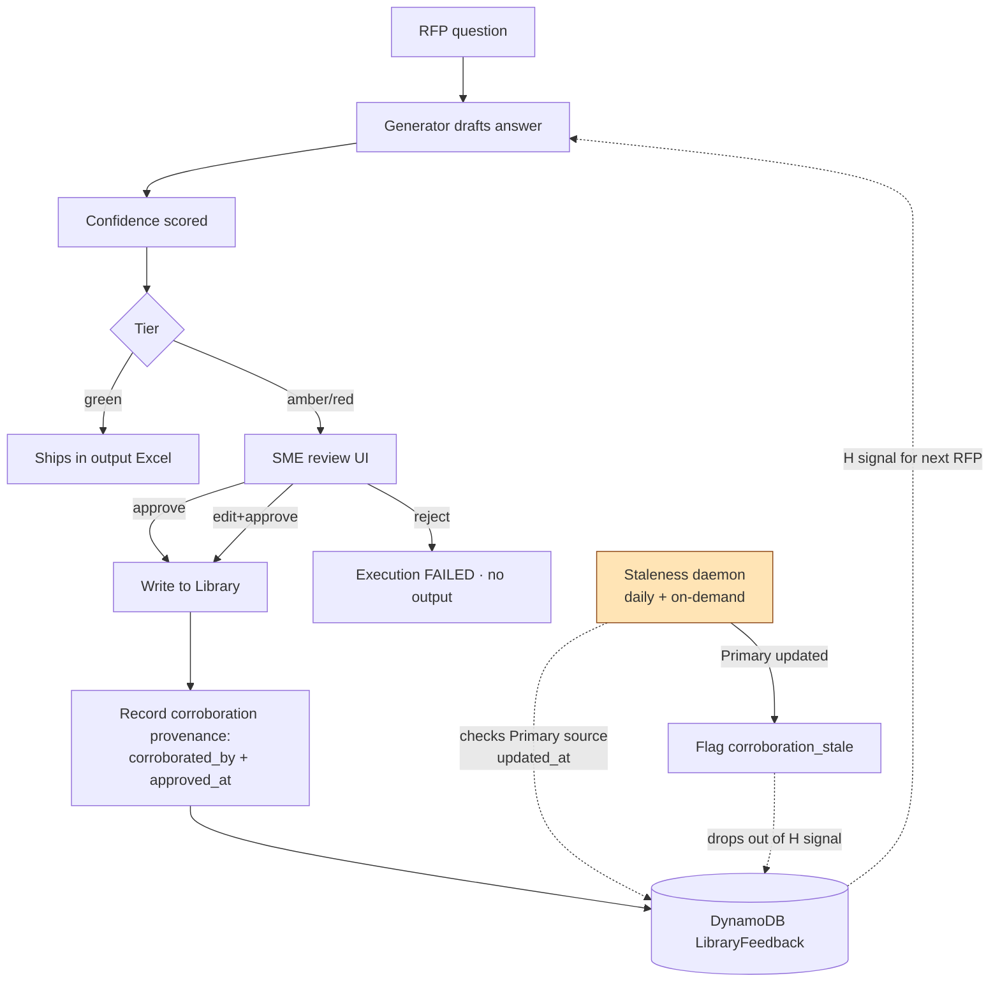
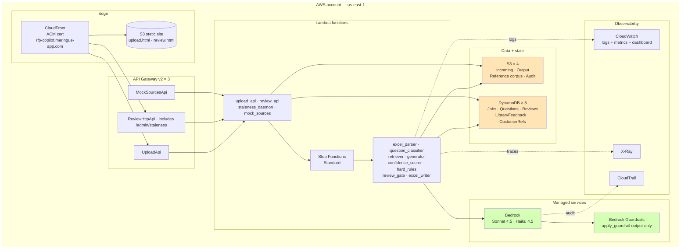

# RFP Redlining Copilot — Architecture walkthrough (v0.5)

**Owner:** H
**Status:** Deployed + demo-ready
**Last updated:** 2026-04-19 (post Phase G — class-based dispatch + auto-ingestion)
**Audience:** AWS freshers. You know the cloud exists and have maybe spun up an EC2 instance, but "Step Functions" and "Bedrock Guardrails" are new words. This doc walks you through the system the way I'd walk a new hire through it on day one.

---

## 0. Read this first — what you're looking at

Imagine a sales rep at a B2B software company. A prospect sends them a 200-question Excel file: "What encryption do you use? Are you SOC 2 certified? What's your uptime SLA?" The rep spends three days chasing subject-matter experts (SMEs) to get each question answered. Then Legal wants to review it. Then it ships.

This project replaces the first two days. The rep drops the Excel into a web page, and a few minutes later they get the same Excel back with answers filled in — color-coded: **green** = "ship this", **amber** = "SME please review", **red** = "do not send without Legal". SMEs review only the amber/red questions instead of the whole thing.

The interesting engineering is not "call an LLM to answer questions." The interesting engineering is everything around that call: making sure the answers cite real sources, making sure we don't quote stale information, making sure we never auto-generate pricing (that's a legal exposure), and making sure the system gets *better* every time an SME approves an answer.

**What you'll learn from this doc:** how to compose AWS managed services into a real production-shaped workflow. By the end, you should understand why we used Step Functions instead of "just one big Lambda," why we split storage into multiple buckets, why Bedrock's guardrail feature isn't quite enough on its own, and what it costs to run.

---

## 1. The AWS services we use — quick glossary

Before the walkthrough, here's a two-line intro to every service you'll see. Don't try to memorise these — come back when you hit a name you don't recognise.

| Service | What it is | Why we use it here |
|---|---|---|
| **S3** (Simple Storage Service) | Object storage — think "Dropbox for your code." Stores files, serves them back, charges per GB-month. | Holds uploaded RFPs, generated outputs, reference documents, and the static UI. |
| **Lambda** | Serverless compute. You write a function; AWS runs it on demand and bills you per millisecond. No servers to manage. | Every piece of logic in our pipeline is a Lambda — parsing, classifying, generating, scoring, writing output. |
| **Step Functions** | A workflow engine. You describe a state machine ("do A, then B, then C, wait for a human, then D") and it runs it reliably. | Orchestrates the whole RFP pipeline. Survives Lambda crashes, retries failed steps, and can *pause* mid-flow to wait for a human (the SME reviewer). |
| **DynamoDB** | NoSQL key-value database. Millisecond reads/writes, serverless, pay-per-request. | Stores job state, per-question audit, SME-approved answers, and customer reference metadata. |
| **API Gateway** | The front door for HTTP APIs. You give it URL patterns; it routes requests to Lambdas. | Exposes three HTTP APIs — one for upload, one for review, one that mocks external SaaS sources. |
| **Bedrock** | AWS's managed LLM service. Call `invoke_model` and you get a response from Claude / Llama / Mistral / etc. Pay per token. | Runs Claude Sonnet 4.5 for answer generation and Claude Haiku 4.5 for classification. |
| **Bedrock Guardrails** | A companion feature of Bedrock. You define "topics to block" and "PII to redact," and it filters model I/O. | Blocks any answer the model accidentally produces that mentions pricing, disparages competitors, or makes an unqualified compliance claim. |
| **Bedrock Knowledge Bases** | Managed RAG — you point it at an S3 prefix, it chunks + embeds + indexes, and you call `Retrieve` with a text query + metadata filter. | The single retrieval surface. Chunks compliance PDFs, product-doc markdown, prior-RFP markdown, *and* SME-approved Q&A markdown with Titan Embed v2 (1024d) into S3 Vectors. Returns filtered passages to the retriever Lambda, discriminated by `source_type` metadata. The H signal is driven by a separate KB query filtered to `sme_approved_answer`. |
| **S3 Vectors** | A cheap vector store that hangs off S3, billed by storage + query. ~$5/month at demo scale vs. ~$350/month for OpenSearch Serverless. | Backing store for the Knowledge Base's embeddings. |
| **CloudFront** | AWS's CDN (content delivery network). Caches your static files at edge locations worldwide. | Serves the upload and review web pages fast + provides HTTPS for our custom domain. |
| **ACM** (Certificate Manager) | Free SSL/TLS certificates. | Gives our domain a valid HTTPS cert. |
| **KMS** (Key Management Service) | Managed encryption keys. | Encrypts every S3 bucket and DynamoDB table with customer-managed keys. |
| **CloudWatch** | Logs + metrics + dashboards. | Collects Lambda logs, Step Functions execution history, and custom metrics. |
| **IAM** (Identity and Access Management) | Permissions. Every AWS call goes through IAM. | Controls which Lambda can read which bucket, invoke which model, etc. |
| **CDK** (Cloud Development Kit) | Infrastructure-as-code, but in TypeScript/Python instead of YAML. | All the above resources are defined in TypeScript files under `infra/`. |

**Mental model for "serverless":** with EC2 (virtual machines), you rent a server by the hour whether it's busy or not. With Lambda + DynamoDB + S3, you pay only for actual work — each API call, each GB stored, each request. For workloads that are idle most of the time (like a demo), this is ~100× cheaper.

---

## 2. The interview framing (why we built it *this* way)

This project is the AWS-native answer to **"could you build Glean-class RFP-redlining for us?"** Glean is a popular enterprise-search startup; they have connectors into every SaaS tool and a unified chat interface. Our version is more focused: one input (Excel), one output (colored Excel), no chat surface. But it demonstrates the *shape* of a Glean-class system using only AWS managed services.

Deliberate omissions — things you'd absolutely use in production but that we skip for the demo tier:
- **Amazon Kendra** (managed enterprise search) — $810/month minimum. Overkill for a demo with five sources.
- **Amazon Neptune** (graph database) — needed for "who are the experts on SOC 2 two hops from me?" queries. We don't have multi-hop queries yet.
- **VPC + PrivateLink** (private networking) — security hardening, adds latency and $100/month in endpoints. Out of scope for demo.
- **Distributed Map** (Step Functions' high-concurrency mode) — for 500-question RFPs. Ours maxes out at ~30.
- **Amazon Q Business** (AWS's version of ChatGPT for enterprises) — the interactive chat surface. Our scope is batch Excel in/out.
- **Cognito** (user authentication) — the demo UI is public so anyone with the link can try it.

Every one of these is listed in §11 as the production scale-up path. Skipping them isn't sloppy — it's scope discipline.

---

## 3. Follow an RFP through the system

Here's the flow, end-to-end. I'll narrate it the way you'd trace a request through logs on your first week.



Now the narration. Follow an RFP named `acme.xlsx` through each stop.

### Step 1 — Rep uploads `acme.xlsx`

The rep visits `https://rfp-copilot.meringue-app.com`. That domain is our custom URL. **CloudFront** (the CDN) serves a static HTML page from **S3**. There's no server rendering anything — it's just a file.

The rep drags the Excel onto the drop zone. The browser calls `POST /upload/presign`. This hits **API Gateway**, which triggers our `upload_api` **Lambda**.

*Wait — why not upload directly from the browser to S3?*

**The presigned URL pattern.** Instead of routing a 5 MB file through Lambda (slow, expensive, 6 MB Lambda payload limit), Lambda generates a *presigned URL* — essentially a temporary, signed link that grants the browser permission to PUT directly to S3 for the next 5 minutes. The browser uploads straight to S3; Lambda never sees the file bytes. This is the canonical pattern for file uploads on AWS and worth internalising.

Once the PUT completes, the browser calls `POST /upload/{jobId}/start`. That tells `upload_api` to kick off the pipeline by calling **Step Functions'** `StartExecution` API. Now the file is under Step Functions' control.

### Step 2 — Step Functions takes over

Step Functions is the piece you should pay closest attention to. It's AWS's answer to "how do I run a multi-step workflow reliably?" You describe the steps, and Step Functions:
- Runs each step (usually by invoking a Lambda).
- Passes the output of one step into the input of the next.
- Retries on transient failures with configurable backoff.
- **Can pause the whole workflow for hours/days while waiting for something external** (like a human to click Approve). This is the killer feature we use.
- Records every state transition to an audit log you can replay months later.

Our state machine looks like this:

```
ParseWorkbook
    ↓
[Map — for each question, in parallel, up to 10 at a time:]
    Classify → Retrieve → Generate → Score → ApplyHardRules
[end Map]
    ↓
ReviewGate (decides: all green? go to writer. any amber/red? wait for SME.)
    ↓  (if waiting)
WaitForReview  ← paused until review_api resumes it
    ↓
WriteOutputWorkbook
```

The **Map state** is how we process questions in parallel. If the RFP has 30 questions, up to 10 run simultaneously. That's what turns "30 × 4 seconds sequential = 2 minutes" into "30 ÷ 10 × 4 seconds = ~12 seconds of active work."

### Step 3 — Per-question pipeline

For each question, five Lambdas run in sequence:



**Classify** uses Claude Haiku (the small, fast Claude) to tag the question with topics like `soc2`, `encryption_at_rest`, `pricing`. Why Haiku and not Sonnet? Classification is a simpler task; Haiku is ~10× cheaper and ~3× faster. Rule of thumb: use the smallest model that's accurate enough.

**Retrieve** looks up relevant documents from the knowledge sources. For the four S3-backed sources (compliance, product-docs, prior-rfps, sme-approved) it calls `bedrock-agent-runtime:Retrieve` against a single Bedrock Knowledge Base, passing a metadata filter (`source_type = compliance_cert | product_doc | prior_rfp | sme_approved_answer`) so one KB serves every retrieval path — primary passages, phrasing-reference priors, *and* the SME-approved Q&A that feeds the H signal. The H signal is a real cosine similarity now, not a topic-tag heuristic. Customer-refs are a straight DynamoDB scan. This is where a lot of the interesting logic lives — see §5.

**Generate** calls Claude Sonnet with the retrieved passages and the question, asking for an answer with citations.

**Score** produces a confidence number between 0 and 1 using five signals (more on this in §6).

**Hard rules** applies the enterprise-legal checks — pricing → red, compliance claim → at least amber, etc.

### Step 4 — The review gate

After scoring, a decision: if every question is green, skip straight to the Excel writer. If *any* question is amber or red, park the whole job and wait for a human.

This is where Step Functions' `waitForTaskToken` feature shines. The `review_gate` Lambda is called with a special token. It stashes the token in DynamoDB and returns. Step Functions then *pauses the execution* — potentially for hours or days — until someone calls `SendTaskSuccess` with that same token.

That "someone" is the `review_api` Lambda. When the SME clicks Approve in the review UI, the browser calls `POST /reviews/{jobId}/approve`, which hits `review_api`, which looks up the task token and calls `SendTaskSuccess`. Step Functions wakes up and runs the Writer Lambda.

If the SME clicks Reject, `review_api` calls `SendTaskFailure` instead — the execution ends with status FAILED, and the job is marked rejected. No output file is produced.

**Why is this hard without Step Functions?** If you tried to build this with a naive "Lambda calls Lambda" chain, the first Lambda would time out in 15 minutes (Lambda's max) waiting for the human. You'd have to invent your own task-token-on-a-database pattern, your own retry logic, your own audit log. Step Functions gives you all of that for free.

### Step 5 — Writer and download

The `excel_writer` Lambda reads the original workbook, the generated answers, and the tier decisions. It writes a new workbook where each answer cell is colored green/amber/red and each question has a comment with the confidence breakdown and citations. The output goes to the Output S3 bucket.

The browser, which has been polling `GET /upload/{jobId}/status` every 5 seconds, now sees `status=SUCCEEDED`. It calls `GET /upload/{jobId}/download`, gets a presigned download URL (same pattern as upload, but read-only), and opens the file.

---

## 4. Business reader cheat sheet

Not the person reading this doc, but the person they report to. Keep this handy for meetings:

| Concern | Answer |
|---|---|
| Time per RFP | ~3 minutes end-to-end for 30 questions; <10 minutes for 100 |
| Cost per RFP | ~$1 of Bedrock per run; ~$3 total including fixed infra during the hour |
| First-draft quality target | 40% green at launch → 70% by month 6 (flywheel lift) |
| Reviewer bandwidth | Amber/red queue routes by topic domain; Pre-Sales handles technical, Compliance handles certs, Deal Desk handles pricing |
| Library ownership | Product Marketing owns content, Sales Enablement distributes, Compliance reviews hard rules, Pre-Sales reviews amber |
| ROI measurement | Matched A/B — half of qualifying RFPs use the tool, half don't; track hours saved + win rate over a quarter |
| Vendor lock-in | Code (Python, Pydantic) is portable; managed services are the swap points |

---

## 5. Source authority — the differentiator

Here's the single most important design decision in the whole project. If you take one thing away from this doc, take this.

**Phase G (2026-04-19) — the topic taxonomy collapsed into four classes.** Rather than a per-topic dispatch table with twenty rows and half a dozen policy fields per row, there are now four classes, and each topic is assigned to exactly one of them:

| Class | Member topics | Primary source(s) | Queries `sme_approved_answer`? | Tier logic |
|---|---|---|---|---|
| `auth_compliance` | soc2, iso27001, fedramp, gdpr, dpa, incident_response, pentest | `compliance_store` (compliance PDFs) | No | GREEN if primary retrieves ≥1 passage, else AMBER. Hard rules demote. |
| `auth_product` | encryption_*, key_management, sso, mfa, scim, dr_bcp, ssdlc, sbom, data_residency | `product_docs` (+ compliance for dr_bcp / residency) | No | Same as auth_compliance. |
| `gated` | pricing, customer_reference | `deal_desk` (n/a) / `customer_refs_db` | No | pricing → RED forced; customer_reference → hard rule 4. |
| `unclassified` | long-tail that misses all topic patterns | `product_docs` (default) | **Yes** — this is where the flywheel runs | Full composite, tier capped at AMBER regardless — human review always required. |

Tier logic is class-aware, not purely composite. An `auth_product` SOC 2 / encryption / SSO question goes green *because the authoritative document answers it*, not because enough signals aggregate above 0.80. Conversely, a long-tail question never goes green automatically — with no primary anchor, human review is the baseline.

**The problem every RFP tool on the market has.** Loopio, Responsive, Arphie — they all work the same way. Salespeople answer questions, SMEs approve the answers, and answers go into a library. Next time a similar question comes up, pull the previous answer and auto-fill.

The failure mode: an answer that was accurate in January 2023 is still in the library in October 2025. The product has changed. The SOC 2 report is a new one. The team that approved it has left. But the library confidently quotes the old answer, and because it has an "SME approved" checkmark next to it, nobody questions it.

**Our answer: separate phrasing authority from factual authority.**

Every topic in our system has a **dispatch plan** that lists:
- **Primary sources** (authoritative): the actual SOC 2 report PDF, the product docs, the customer references database
- **Secondary sources** (phrasing only): prior SME-approved answers

Prior answers are a *phrasing reference*, not a *factual authority*. Even if an answer is in LibraryFeedback with five SME approvals, if the underlying SOC 2 report has been updated since that approval, we **suppress the prior answer entirely** and the generator gets only the current Primary source.



### The four corroboration rules

| Rule | Trigger | Effect |
|---|---|---|
| 1. Freshness suppression | Prior's `approved_at` is older than *any* Primary source's `updated_at` | Suppress the prior entirely; the generator never sees it |
| 2. Primary required | Topic has `corroboration_required: true` AND no Primary source returned hits | Cap the answer's tier at amber (so an SME must confirm) |
| 3. Force-tier override | Topic has `force_tier: red` (pricing, commercial) | Hard-rules engine forces red regardless of confidence |
| 4. Customer name gating | The answer names a customer that isn't in CustomerRefs with `public_reference=true` + unexpired approval | Force amber |

**Rule 1 is the anti-decay mechanism.** It's cheap (two timestamp comparisons per retrieval), deterministic (no LLM involved, so always produces the same decision), and it addresses the single highest-risk failure mode in the whole category. If you understand Rule 1, you understand why our system is different from a naive library-fill approach.

### Dispatch table — where the decisions are encoded

```python
# lambdas/question_classifier/dispatch.py
DISPATCH_TABLE: dict[str, DispatchPlan] = {
    "soc2": DispatchPlan(
        primary=["compliance_store"],
        secondary=["prior_rfps"],
        corroboration_required=True,
        max_tier_without_primary=Tier.AMBER,
    ),
    "encryption_at_rest": DispatchPlan(
        primary=["product_docs"],
        secondary=["prior_rfps"],
        corroboration_required=True,
    ),
    "pricing": DispatchPlan(
        primary=["deal_desk"],
        force_tier=Tier.RED,
        reason="pricing_never_autogenerated",
    ),
    # ...
}
```

For the demo it's hardcoded Python. For production, you'd move this to `config/source_authority.yaml` so Product Marketing + Compliance + General Counsel can review quarterly without a code deploy.

---

## 6. How we score confidence

The tier (green/amber/red) comes from a weighted sum of five signals. No single signal decides; they all contribute.



Reading the signals:
- **H (0.45)** — how closely does an SME-approved prior answer match this question, measured as cosine similarity between the incoming question's embedding and the best-matching entry in the `sme_approved_answer` slice of the KB. Phase G: H is only queried for `unclassified` topics. For `auth_compliance` and `auth_product` classes, the H signal is intentionally skipped — the authoritative primary source is the anchor and SME-approved phrasing cannot propagate misinformation into future answers. (Phase F note: before Phase F this was a fake 0.82 whenever any topic tag overlapped — it's a real semantic score now where it runs.)
- **R (0.25)** — how strong is the retrieval? If the classifier said "soc2" and the retriever returned five SOC-2-related passages, R is high. If it returned zero, R is low.
- **C (0.15)** — coverage across sources. An answer citing three different sources is more trustworthy than one citing one.
- **F (0.10)** — freshness. How recently was the retrieved evidence updated?
- **G (0.05)** — did the Bedrock Guardrail flag anything? Small weight because it's a binary pass/fail.

**Thresholds:** ≥0.80 green · 0.55–0.80 amber · <0.55 red.

### Why we don't ask the LLM "how confident are you?"

You might wonder: why not just add "rate your confidence 0-100" to the prompt? Because modern LLMs are **overconfident on wrong answers**. They'll happily tell you they're 95% sure about something they just hallucinated. A composite of measurable signals is *tunable* (we can calibrate the weights against labeled data), *explainable* (a sales leader can see exactly which signal was weak), and *unfoolable by the model itself* (the model never gets to vote on its own confidence).

### The "no greens without priors" gotcha

Look carefully at the weights. The non-H signals sum to `0.25 + 0.15 + 0.10 + 0.05 = 0.55`, right on the amber/red boundary. That means **if H = 0 (no SME-approved prior answer matches), the best possible score is 0.55 — which is amber.**

This is intentional. "Green" means "an SME has signed off on substantially similar content before." A brand-new deployment with an empty LibraryFeedback table literally cannot produce a green answer. You have to seed the library first (see §16). Every team that spins this up fresh and wonders why everything is amber has tripped on this same trap — now you know.

---

## 7. Hard rules — the legal backstop

After the composite score, one more filter runs: the hard rules. These only ever *demote* tiers, never promote.

| Trigger | Effect | Why |
|---|---|---|
| Pricing / commercial language | Forced RED | An unsigned RFP that quotes prices can legally be construed as an offer in some jurisdictions |
| Compliance / certification claim without citation | Minimum AMBER | Hallucinating "we're HIPAA certified" is a breach-of-warranty problem |
| Unapproved customer name | Minimum AMBER | Logo rights and case-study approvals are tracked in CustomerRefs |
| Forward-looking ("will deliver by Q3") | Minimum AMBER | Commitment risk on a roadmap Product hasn't ratified |
| Competitor disparagement | Forced RED | Legal exposure + brand damage |

These aren't AI-safety preferences. They're **enterprise-legal constraints** — the kind a General Counsel would write into a policy document. The test suite at `lambdas/tests/test_hard_rules.py` locks their behavior. If a test starts failing because you changed a rule, treat that as a policy change that needs legal review, not a bug to silence.

### Bedrock Guardrails — the second layer

We also use **Bedrock Guardrails**, a managed feature that lets you declare "topics to block" and "PII to redact" as configuration (not code). Our guardrail blocks pricing talk, competitor disparagement, and unqualified compliance claims.

**Important subtlety.** Bedrock Guardrails can attach to `invoke_model` in two places: on the *input* (the user's question) or on the *output* (the model's answer). Our RFP questions *are about* pricing and compliance — that's the whole point. Blocking the input would kill the pipeline. So we only guardrail the output: call `bedrock_runtime.apply_guardrail()` with `source="OUTPUT"` *after* generation. The topic policies gate what we *say*, not what we *hear*.

This subtlety cost me half a day to debug. Every generation call was silently failing with "input contains content that cannot be processed." If you ever see that message, check which direction your guardrail is attached to.

---

## 8. The feedback loop — how the library gets smarter (and self-cleans)

This is the second-most-interesting design decision after source authority.



The flywheel has two phases after Phase G.

**Phase F + G — SME approval flow (now fully event-driven):**

1. **The approved Q&A is written to S3 as markdown + Bedrock metadata sidecar** at `sme-approved/<id>.md` by the Review API Lambda. The sidecar carries `source_type=sme_approved_answer`, `approved_by`, `approved_at`, `expires_on`, `question_text`.
2. **The PutObject event fires the `ingestion_trigger` Lambda via EventBridge** (no direct bucket-to-Lambda notification — avoids the cross-stack cycle that direct notifications would create between storage and orchestration stacks). The Lambda calls `bedrock-agent:StartIngestionJob` and returns. If a job is already running, it catches `ConflictException` and logs — the next upload picks up the combined delta.
3. The approval becomes semantically retrievable in ~1–3 minutes (the ingestion cycle).

**Phase G — the key scoping rule:** SME-approved answers only feed the H signal for **`unclassified` topics** (long-tail questions where no primary source exists). For `auth_compliance` and `auth_product` topics, SME-approved answers are never queried. This is deliberate anti-propagation: a stale SME approval on a SOC 2 question from 18 months ago cannot leak into today's SOC 2 answer because the system goes directly to the current `compliance_cert` source. Misinformation can't compound.

**Two belt-and-suspenders safety nets** ensure source currency without a staleness daemon:
- A **weekly EventBridge rule** fires the same `ingestion_trigger` Lambda. KB ingestion is delta-based, so this is a near-zero-cost no-op on an unchanged corpus; it catches silent S3-event pipeline stalls within 7 days.
- A **yearly EventBridge rule** runs a 12-monthly dormancy guard for the same reason at a longer cadence.

The old `_apply_freshness_suppression` function and the out-of-band `staleness_daemon` Lambda are both deleted. Source currency is a property of ingestion operations now, not a query-time inter-passage comparison.

---

## 9. The five simulated data sources

We picked five sources to demonstrate *five different AWS integration patterns*. If they were all just S3 buckets, the architecture would be boring and you'd learn nothing.

| Source | Simulated as | The AWS pattern it shows you |
|---|---|---|
| Compliance store | `s3://…/compliance/*.pdf` — SOC 2, ISO 27001, FedRAMP PDFs, indexed by Bedrock KB | Small, high-authority, freshness-critical document store |
| Product docs | `s3://…/product-docs/*.md` — encryption, DR, SSO/MFA long-form markdown, same KB | Medium-corpus feature documentation |
| Prior RFPs | `s3://…/prior-rfps/*.md` — phrasing reference only, same KB, freshness-suppressed | Secondary source gated by the freshness rule |
| SME-approved Q&A | `s3://…/sme-approved/*.md` — SME-signed Q&A, same KB, drives the H signal via real cosine similarity | Semantic self-cleaning library — KB indexed, freshness-suppressed |
| Customer References | DynamoDB `CustomerRefs` with `public_reference`, `approval_expires`, `industry` | Fast key-value lookup; the hard-rule gate |
| Seismic + Gong | **Single** `mock_sources` Lambda behind API Gateway (`/seismic/content`, `/gong/calls`) | External SaaS REST API — OAuth-style header, simulated latency, simulated rate limits |

The mock Seismic/Gong Lambda deliberately misbehaves: 5% error rate, occasional 2s tail latency, per-minute quotas. This lets us demo the **circuit breaker firing live** — when a source has three consecutive failures, the retriever skips it for the rest of the job and the confidence scorer's C (coverage) signal downweights accordingly. Nothing crashes; the answer just gets flagged amber with `source_degraded:gong`. That's real production behavior you should plan for from day one, not bolt on later.

---

## 10. The four optimizations that actually matter

AWS has a million optimization knobs. Four of them are worth your attention for this kind of workload.

**1. Topic routing.** The classifier Lambda outputs a `dispatch_plan` listing only the sources relevant to that question. A SOC 2 question dispatches to Compliance store + Prior RFPs — not to Seismic, Gong, or Customer Refs. For a 30-question RFP, naïve "query every source for every question" would be 150 API calls; topic routing makes it ~60. Zero wasted work.

**2. Parallel fan-out within a question.** The retriever calls every relevant source *concurrently* using Python's `asyncio.gather`. For a 3-source question at 120ms/350ms/50ms latencies, sequential would take 520ms; parallel takes 350ms (the max). Easy win.

**3. Bedrock prompt caching.** Every generator call starts with ~3K tokens of system prompt (voice guidelines + hard-rule summary + answer patterns). That prefix is *identical* across all 30 questions in a run. Bedrock lets you mark it `cache_control: ephemeral` and bills the cached portion at ~10% of normal cost on subsequent calls. Saves ~$0.40 per run — small absolutely, but it scales linearly with volume.

**4. Circuit breakers.** Every external source call has a breaker: 3 consecutive failures and we skip that source for the rest of the job. The composite confidence's C signal downweights accordingly. The breaker itself is a handful of lines; the *discipline* of planning for sources to fail is what you want to internalise.

---

## 11. When to outgrow the demo tier

The demo is deliberately small. Here's the production scale-up path you'd hand to your architect.

| When this happens | Do this |
|---|---|
| Sustained retrieval QPS above ~5 req/s, or corpus >~100k docs | Move the KB storage from **S3 Vectors** to **OpenSearch Serverless** (`AOSS`) — richer filter syntax, no per-doc metadata cap, sub-100ms tail latency. Base cost jumps from ~$5/mo to ~$350/mo minimum. |
| > 10 source systems | Replace mock APIs with **Amazon Kendra** + its native connectors (Slack, Confluence, SharePoint, etc.) |
| Multi-hop graph queries ("SMEs two hops from this topic") | Promote CustomerRefs + LibraryFeedback to **Neptune Serverless** |
| Strict data residency / ACL inheritance needed | Add **VPC + PrivateLink**, enable Kendra ACLs, move to **IAM Identity Center** |
| > 100-question RFPs at 25x parallelism | Upgrade `Map` → **Distributed Map** with per-item audit |
| Sales reps want interactive chat, not just batch | Add **Amazon Q Business** pointing at the same Kendra index |
| Iterative retrieval loops ("query more if uncertain") | Wrap the generator in **Bedrock Agents / AgentCore** |
| High, sustained Bedrock volume | Move to **Bedrock Provisioned Throughput** (buy reserved capacity) |
| Enterprise audit needed | Enable **CloudTrail data events**, **GuardDuty**, **Macie**, **Verified Permissions** |
| UI needs auth | **Cognito** User Pool + **CloudFront signed cookies** |

Every one of these is **additive** — you slot the new service in without rewriting the pipeline. That's the payoff for picking managed services with clear boundaries.

---

## 12. Trade-offs — the decisions I can defend

When you're new, "trade-off" can feel like hand-waving. These are concrete: for each one, here's what we chose, what we *could* have chosen, and what it costs us.

| Choice | Why we did it | What we give up |
|---|---|---|
| Hardcoded dispatch table in Python | One less moving part for demo | Production needs YAML config so non-engineers can review |
| No Kendra in demo | $810/month fixed cost; 15 min setup; unnecessary at 5 sources | Miss Kendra's native connectors + ACL inheritance |
| No Neptune in demo | ~$250/month; demo has no multi-hop queries | No graph-traversal stories; DynamoDB + GSIs handle single-hop |
| Step Functions **Standard** (not Express) | We need `waitForTaskToken` for human review; full audit trail for legal | Higher per-execution cost; Express is cheaper but max 5 min and no task tokens |
| `Map` state (not Distributed Map) | 30 questions at concurrency 10 is fine | Won't handle 500 questions without an upgrade |
| Freshness suppression without LLM cross-check | Deterministic, cheap, handles the decay failure | May over-suppress on genuinely stable answers; SME feedback corrects |
| Composite confidence, not LLM self-report | LLMs are overconfident on wrong answers; composite is tunable | Needs offline weight calibration against labeled data |
| Hard rules as Python regex + config | Fast, auditable, General Counsel can review | May miss novel phrasings; Bedrock Guardrails is the second layer |
| Guardrail on output only | Inline guardrail blocks legitimate input questions | One extra API call per generation; negligible |
| Mock Seismic + Gong as one Lambda | Fewer resources for the demo | Loses the "separate SaaS integrations" visual |
| One Excel in, one Excel out | Matches how sales actually works today | No chat surface; Q Business is the production add |
| No VPC in demo | Skip $100/mo endpoints + faster deploy | Lose defense-in-depth; flag as production hardening |
| Bedrock, not OpenAI | AWS-native audit, VPC endpoints, Guardrails | Slightly narrower model catalog |
| No Object Lock on Incoming | Object Lock requires checksum headers that browser presigned uploads don't send | Production needs Object Lock back, with a pre-PUT Lambda that injects checksums |
| S3 CORS scoped to our exact domain | Browsers require it for direct S3 PUT | Must be updated if the domain changes |
| SigV4 with pinned `Content-Type` | Browser `fetch` forces Content-Type; SigV2 puts it in the signature → mismatch | SigV4 is current-gen anyway; no real loss |
| Static UI, no auth | Fastest path to a shareable demo URL | Production needs Cognito + signed cookies |
| Review UI polls upload API for download | Simpler than wiring EventBridge → WebSocket | Up to 5-second UX latency; production would push events |

---

## 13. What's actually deployed



**Six CDK stacks:** `storage` · `data` · `knowledge-base` · `orchestration` · `observability` · `static-site`. The `knowledge-base` stack owns the S3 Vectors bucket + index, the Bedrock KB + data source, and the KB service role (with `kms:Decrypt` on the reference corpus CMK — without that grant, ingestion silently scans zero documents). The `data` stack holds four DynamoDB tables: Jobs, Questions, Reviews, CustomerRefs. The former LibraryFeedback table was removed in Phase F — SME-approved Q&A are now stored as markdown in S3 and indexed by the KB alongside everything else.

Why five stacks and not one? Each stack is a CloudFormation template under the hood. Keeping them separate means you can deploy the UI (`static-site`) without also redeploying all twelve Lambdas (`orchestration`). Shorter deploy cycles → faster iteration. Stacks reference each other through public-readonly fields on the CDK constructs — CDK resolves the cross-stack dependencies at synth time.

---

## 14. What this costs

| Mode | Cost |
|---|---|
| Running during a 1-hour demo | ~$3 (Bedrock usage + fixed infra) |
| Running 24/7 | ~$125/month (no Kendra/Neptune; fixed costs are KMS, CloudWatch, DynamoDB minimums, CloudFront, ACM, plus ~$5/mo S3 Vectors for the KB) |
| Deploy + demo + destroy cycle | ~$4 per cycle |
| Per-RFP variable cost (30 questions) | ~$1 in Bedrock tokens; negligible for everything else |
| KB ingestion (one-time per corpus rev) | A few cents of Titan Embed v2 calls for ~16 chunks; re-runs only when corpus changes |

**The cost strategy: destroy the stack between demos.** `npx cdk destroy --all` tears it down; `npx cdk deploy --all` brings it back in ~5 minutes. When you're not running a demo, you pay almost nothing. This is the core AWS serverless promise — idle resources should be free. That you can genuinely act on it (unlike EC2, where you still pay for the instance sitting idle) is the whole reason we built on Lambda and DynamoDB instead of EC2 and RDS.

---

## 15. Why this is *not* agentic (and why you should resist making it so)

You'll hear a lot about "AI agents" in AWS circles — Bedrock Agents, AgentCore, etc. They're real, they're useful, and they're **wrong for this workload.**

Our orchestration is deterministic by design. Step Functions owns sequencing; Lambdas own stages; the LLM is called at fixed points to do non-deterministic work *inside* a bounded envelope. That gives us:
- Replayable audit (every step is logged)
- Predictable cost (no agent loop that decides to make 47 extra LLM calls)
- Governance that doesn't depend on the model remembering a policy

**When agentic is the right call:** iterative retrieval ("this evidence is thin, let me query another source"), critique-and-revise generation ("draft → self-critique → redraft"), dynamic routing ("pick the best SME based on topic + workload"). All three are real use cases; all three are out of scope for RFP-redlining, which is batch, audit-sensitive, and legally constrained.

**The interview version of this argument:**
*"This workflow is legal-adjacent, audit-sensitive, and latency-bounded. The orchestration is deterministic by design: Step Functions owns sequencing, Lambdas own stages, and the LLM is called at fixed points inside a bounded envelope. That gets me replayable audit, predictable cost, and governance that doesn't depend on the model remembering a policy. AgentCore becomes the right call when retrieval is iterative or generation is self-critical — for a batch workflow with fixed stages and hard legal constraints, direct InvokeModel inside Step Functions is the cheaper, more auditable, more debuggable choice."*

The shorter version: **don't reach for agents until deterministic orchestration genuinely can't solve your problem.**

---

## 16. What you'll find if you deploy this today

All v0.5 demo-tier stacks are deployed in `us-east-1`.

**Implemented and live**
- 5 CDK stacks (storage, data, orchestration, observability, static-site)
- 12 Lambdas (see §13 diagram)
- Step Functions state machine with Map (concurrency 10) and `waitForTaskToken` gate
- Bedrock Guardrail with topic policies, applied output-only
- Static UI at `https://rfp-copilot.meringue-app.com`
- 4 test suites passing locally: `test_excel_parser`, `test_confidence_scorer`, `test_hard_rules`, `test_source_authority`

**Reference data seeded** (via `scripts/seed_reference_data.py`)
- 6 JSON documents in the reference corpus bucket (3 compliance: SOC 2, ISO 27001, FedRAMP · 3 product-docs: encryption, SSO/MFA, DR)
- 5 customer records in CustomerRefs (one intentionally expired, one intentionally private — to demonstrate hard-rule #4)
- 8 SME-approved Q&A in LibraryFeedback (encryption, TLS, SSO, MFA, DR, backup, incident response, access control) — this is the H signal. **Without this seed, every answer is red or amber.**

**Demo RFPs** (in `data/incoming/`)
- `demo_rfp_techops.xlsx` — 12 questions picked for strong corpus/library coverage → mostly green, some amber, one red
- `demo_rfp_compliance.xlsx` — 12 compliance-corroboration questions → mostly amber, two red
- `demo_rfp_enterprise.xlsx` — 12 commercial/forward-looking questions → red-heavy

**Known follow-ups** (not demo-blocking)
- Circuit breaker on mock_sources fires correctly but doesn't yet surface a CloudWatch dashboard metric
- Bedrock `SONNET` is pinned at Sonnet 4.5 pending marketplace subscription for Sonnet 4.6
- No auth on the static UI

---

## 17. Operational notes — gotchas I wish someone had told me

Real deployment lessons from 2026-04-16. Each one cost me at least an hour; reading this may save you that.

**Bedrock model access is an "opt-in" thing.** The Bedrock catalog lists every Claude model, but you can only call the ones you've *requested access to* in the console. If `invoke_model` returns "AccessDenied" despite correct IAM, go to Bedrock → Model access and request Sonnet 4.5.

**S3 Object Lock cannot be disabled.** Once a bucket is created with `objectLockEnabled: true`, you cannot turn it off — not in the console, not in the CLI, not via CDK. If you enabled it and now need to remove it (because browser presigned uploads don't include the required checksum header), the *only* path is `cdk destroy` → `cdk deploy`. CDK's default `RETAIN` removal policy keeps the old bucket around; you'll need to empty and delete it by hand from the console first, or CDK creates new buckets with different auto-generated names and your URLs break.

**CloudFront alias conflicts on redeploy.** If you destroy the static-site stack while your DNS CNAME still points to the old CloudFront distribution, the *next* `cdk deploy` fails with `409 InvalidRequest: alias incorrectly configured`. CloudFront refuses to let two distributions claim the same hostname. Fix: delete the CNAME before the destroy, then recreate it pointing at the new distribution's domain after the deploy completes.

**ACM certificates auto-renew if the DNS validation record is still there.** If you delete the Cloudflare validation CNAME, ACM issues a new validation on next deploy — and your stack blocks until you add the new CNAME. Keep those records around.

**API Gateway URLs change on destroy/recreate.** The auto-generated URLs (the `9fdxjyjafl.execute-api...` kind) are per-deployment. Our static HTML has them hardcoded in three places: `uploadApiUrl` in `ui/upload.html`, `apiUrl` in `ui/review.html`, and `uploadApiUrl` in `ui/review.html` (used by the post-approval download polling). After a full destroy/recreate, update all three, then redeploy the `static-site` stack.

**Reference-corpus seeding is mandatory on first deploy.** Empty LibraryFeedback → composite capped at 0.55 → every answer is amber or red. Run `python3.13 scripts/seed_reference_data.py` after the first deploy. The seeder isn't idempotent in a strict sense — each run generates new UUIDs, so rerunning creates duplicates. Clear the table if you need deterministic state.

**CustomerRefs key casing.** The CDK-created DynamoDB table uses `customerId` (camelCase) as its partition key. The source JSON at `data/graph/customers.json` uses `customer_id` (snake_case). The seeder remaps it. If you write a new loader, follow suit or you'll see `ValidationException: The provided key element does not match the schema`.

**Guardrail input vs output.** The generator handler calls `check_output()` from `shared/bedrock_client.py` *after* generation. The inline `guardrailIdentifier` parameter on `invoke_model` was removed deliberately — leaving it in blocks legitimate pricing/compliance questions at the input stage and silently corrupts the demo. If you ever see "Input contains content that cannot be processed," that's what happened.

**Bedrock KB on S3 Vectors: non-filterable keys are required.** S3 Vectors caps filterable metadata per vector at 2048 bytes. Bedrock KB stores the chunk text under `AMAZON_BEDROCK_TEXT` and chunk context under `AMAZON_BEDROCK_METADATA` — both easily exceed 2048 bytes on normal 300-token chunks. Mark both keys as non-filterable in the index's `metadataConfiguration.nonFilterableMetadataKeys` so they don't count toward the budget (they stay retrievable — just not usable in filter expressions, which you'd never want for raw chunk text anyway). Symptom if you miss this: ingestion "completes" with `numberOfDocumentsFailed` far exceeding `numberOfNewDocumentsIndexed`, and the job's `failureReasons` say *"Filterable metadata must have at most 2048 bytes."*

**Hardcoded CFN physical names fight replacement.** `AWS::S3Vectors::Index` `indexName` and `AWS::Bedrock::KnowledgeBase` `name` are account-scoped unique. If you hardcode them and later change a property that requires replacement (like the index's `metadataConfiguration`), CFN's default order — create-new-then-delete-old — fails with `AlreadyExists`. Fix: omit `indexName` entirely so CFN auto-generates (supported by `CfnIndex`); for the KB, keep `name` but include a manual version suffix you bump when an immutable property changes (`rfp-copilot-corpus-kb-v2`, `-v3`, …). Ugly but unavoidable for resources with required unique names.

**Cross-stack export blocks in-place replacement.** When the KB is replaced, the `ExportsOutput...KnowledgeBaseId` value needs to change, but CFN refuses to update an export that's currently imported by another stack (`Cannot update export ... as it is in use by rfp-copilot-dev-orchestration`). Workaround is a three-deploy dance: (1) edit `bin/app.ts` to pass the current KB id/arn as *literal strings* to orchestration and redeploy it — this breaks the import; (2) deploy the KB stack — now unblocked to replace; (3) revert `bin/app.ts` to reference `knowledgeBase.knowledgeBaseId` and redeploy orchestration to pick up the new KB.

**KB replacement can orphan the old DataSource.** During the CFN replacement sequence the old VectorIndex gets deleted before the old DataSource, and the DS then can't delete its own vector-store data ("Unable to delete data from vector store"). CFN abandons the DS + its parent KB. Fix it manually: `aws bedrock-agent update-data-source ... --data-deletion-policy RETAIN`, then `delete-data-source`, then `delete-knowledge-base`. Cheap (empty orphan KBs are ~free) but noisy in the console — clean up after any KB replacement.

---

## Appendix — what to read next

If you got here and want to go deeper:

- **`CLAUDE.md`** — the handoff contract. Explains how Claude Code (the AI pair-programmer used to build this) should operate on this codebase. Written for a model but readable by humans.
- **`docs/technical-faqs.md`** — 47 Q&A aimed at defending the design in an interview setting. Think of it as the "FAQ a critical reviewer would ask."
- **`docs/archive/architecture-plan-v0.4.md`** and **`architecture-diagram-v0.4.md`** — the *previous* (bigger, more production-shaped) design. Useful to see what we removed and why.
- **`scripts/seed_reference_data.py`** — the corpus + DynamoDB seeder. Read this to understand the shape of the reference data.
- **`scripts/create_demo_rfps.py`** — generates the three demo RFP Excel files. Read this to understand what kinds of questions trigger what kinds of scores.
- **AWS docs worth bookmarking:** Step Functions [waitForTaskToken](https://docs.aws.amazon.com/step-functions/latest/dg/connect-to-resource.html#connect-wait-token) · S3 [presigned URLs](https://docs.aws.amazon.com/AmazonS3/latest/userguide/ShareObjectPreSignedURL.html) · Bedrock [prompt caching](https://docs.aws.amazon.com/bedrock/latest/userguide/prompt-caching.html) · Bedrock [Guardrails apply_guardrail API](https://docs.aws.amazon.com/bedrock/latest/APIReference/API_runtime_ApplyGuardrail.html).

That's the system. Go build something.
