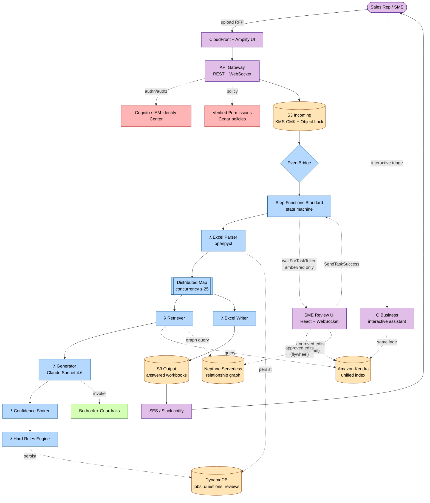
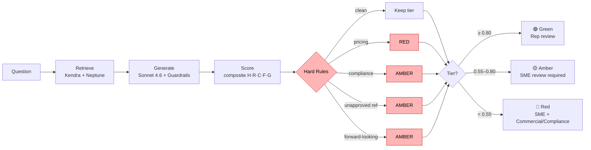
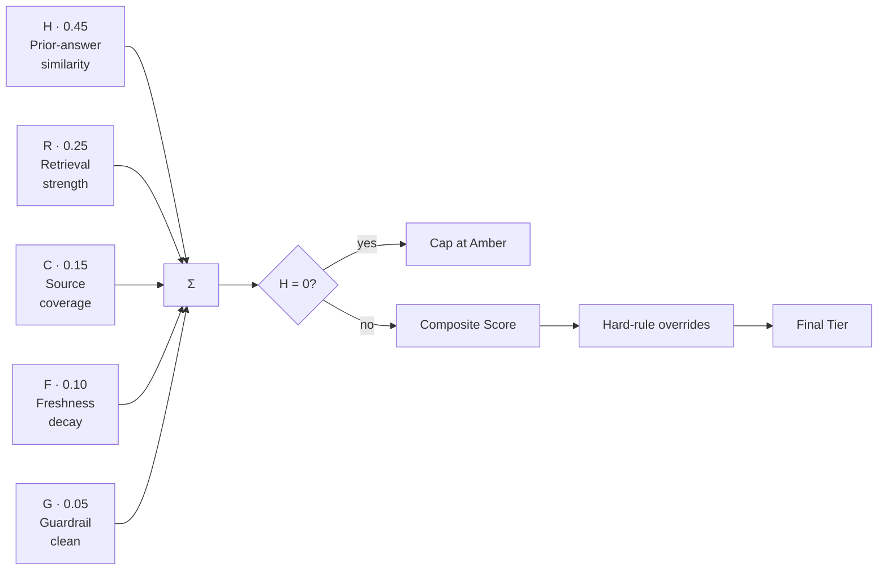
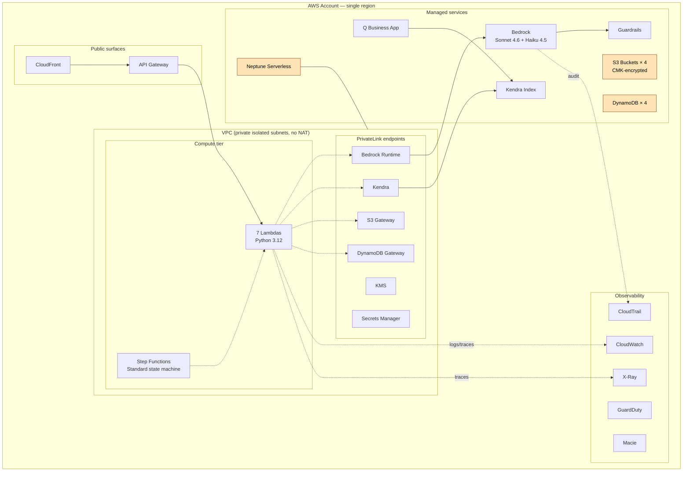

# Architecture Diagrams

Mermaid diagrams for the RFP Redlining Copilot. These render natively
in GitHub, VS Code, and most Markdown viewers. Paste into slides via
mermaid.live → export PNG/SVG.

See `architecture-plan.md` §3–§5 for the text description that these
diagrams visualize.

---

## 1. End-to-end data flow

---

## 2. Per-question pipeline (inside the Distributed Map)

---

## 3. Confidence composite formula (visualization)

---

## 4. Deployment topology (AWS account view)

---

## How to use these for the demo deck

1. Open <https://mermaid.live> in a browser.
2. Paste any block (without the backticks) into the editor.
3. Export PNG (2x scale) or SVG.
4. Drop into slides; each diagram is self-contained.

The per-question pipeline (Diagram 2) is the single most effective
slide for explaining the confidence + hard-rules story to a mixed
technical/business audience. Lead with it.
